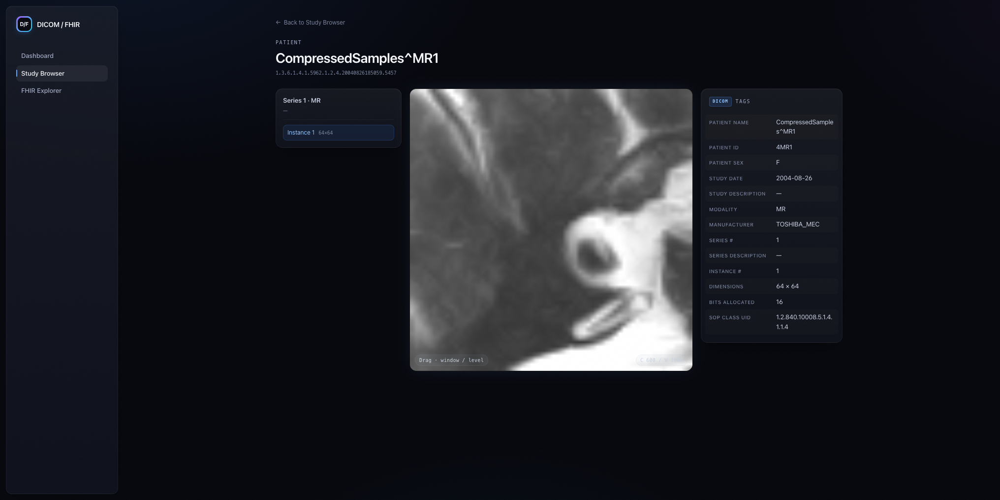
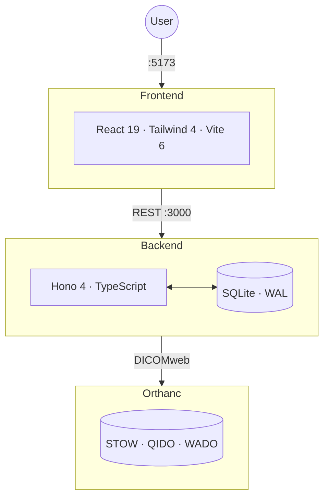
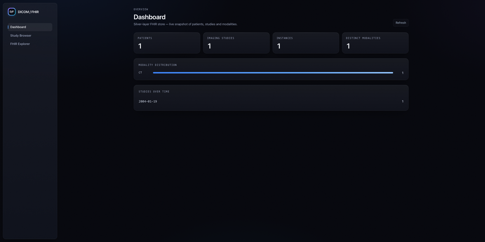
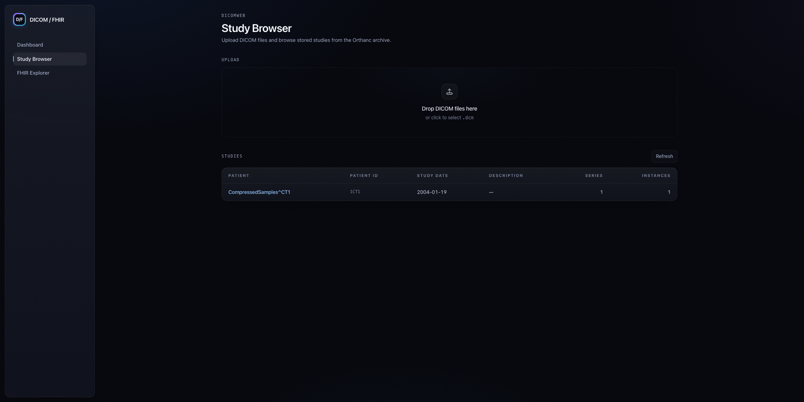
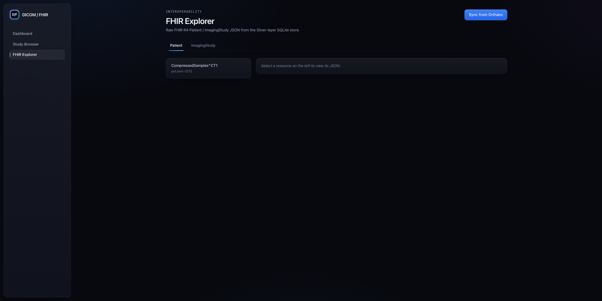

# DICOM/FHIR Viewer

[](https://github.com/ANcpLua/dicom-fhir-viewer/actions/workflows/ci.yml)
[](https://codecov.io/gh/ANcpLua/dicom-fhir-viewer)

Upload DICOM files, browse studies, view medical images with window/level controls, and explore the auto-generated FHIR R4 resources — all from the browser.



## Architecture



## Quick Start

Docker, Node 20+, and npm.

```bash
docker compose up -d            # Orthanc PACS
cd backend  && npm i && npm run dev &
cd frontend && npm i && npm run dev &
```

Open **http://localhost:5173** and drop a `.dcm` file onto the upload zone.

A public test file ships in `sample-data/CT_small.dcm`.

## Screenshots

| Dashboard | Study Browser |
|:-:|:-:|
|  |  |

| Study Detail | FHIR Explorer |
|:-:|:-:|
|  |  |

## Stack

| Layer | Technology |
|-------|-----------|
| PACS | Orthanc 25.2 (Docker) |
| Backend | Hono 4, better-sqlite3, TypeScript strict |
| Frontend | React 19, Vite 8, Tailwind CSS 4 |
| Tests | Vitest 3, Testing Library, 281 cases, 99%+ coverage |

## Testing

```bash
cd backend  && npm test
cd frontend && npm test
```

## License

[MIT](LICENSE) © Alexander Nachtmann
